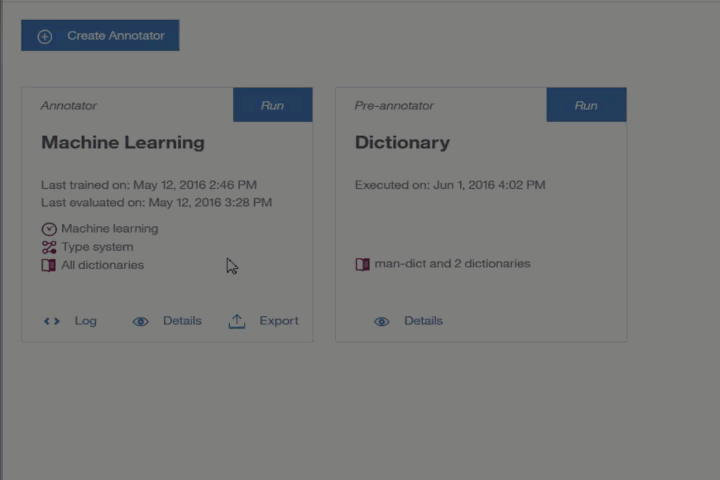

---

copyright:
  years: 2015, 2017
lastupdated: "2017-08-14"

---

{:shortdesc: .shortdesc}
{:new_window: target="_blank"}
{:tip: .tip}
{:pre: .pre}
{:codeblock: .codeblock}
{:screen: .screen}
{:javascript: .ph data-hd-programlang='javascript'}
{:java: .ph data-hd-programlang='java'}
{:python: .ph data-hd-programlang='python'}
{:swift: .ph data-hd-programlang='swift'}

# How to deploy a model
{: #alchemylanguage-gif}

The graphic illustrates how to deploy a machine-learning annotator for use by {{site.data.keyword.alchemylanguagefull}}.
{: shortdesc}

After the model is available, you can pass the model ID and API key as parameters to the {{site.data.keyword.IBM_notm}} {{site.data.keyword.alchemylanguageshort}} REST API endpoints. The code uses your trained model to extract information from text.

**Related tasks**:

[Deploying a machine-learning annotator to {{site.data.keyword.IBM_notm}} {{site.data.keyword.alchemylanguageshort}}](/docs/services/knowledge-studio/publish-ml.html#wks_mabluemix)
