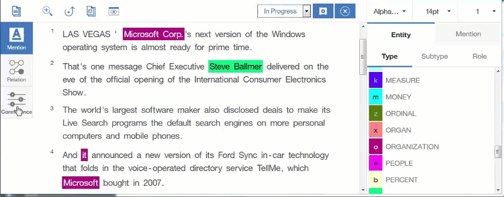

---

copyright:
  years: 2015, 2017
lastupdated: "2017-08-14"

---

{:shortdesc: .shortdesc}
{:new_window: target="_blank"}
{:tip: .tip}
{:pre: .pre}
{:codeblock: .codeblock}
{:screen: .screen}
{:javascript: .ph data-hd-programlang='javascript'}
{:java: .ph data-hd-programlang='java'}
{:python: .ph data-hd-programlang='python'}
{:swift: .ph data-hd-programlang='swift'}

# How to create a coreference chain
{: #coref-gif}

Click each mention in the document that refers to the same entity. You must double-click the last mention to create the chain.
{: shortdesc}

The chain is added to the Coreference Chains list in the sidebar, and is assigned a number. Within the document, the coreference chain number is displayed in subscript with each mention that belongs to that chain.

## Related tasks

[Annotating mentions as coreferences](/docs/services/knowledge-studio/user-guide.html#wks_hacoref)
