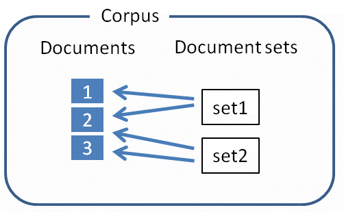
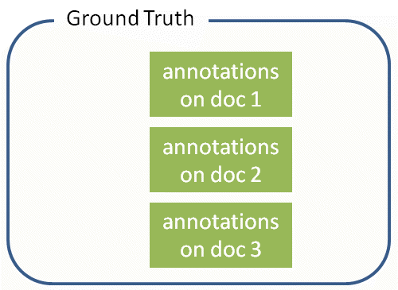
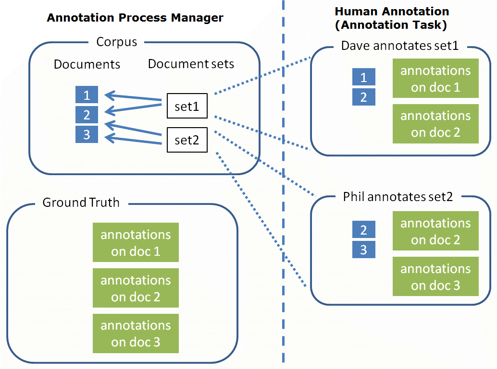
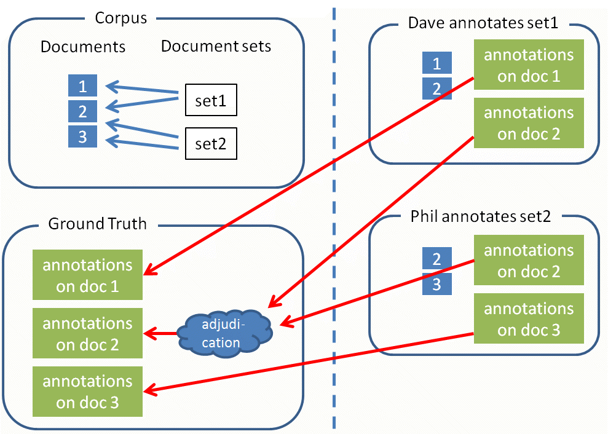

---

copyright:
  years: 2015, 2018
lastupdated: "2018-01-05"

---

{:shortdesc: .shortdesc}
{:new_window: target="_blank"}
{:tip: .tip}
{:pre: .pre}
{:codeblock: .codeblock}
{:screen: .screen}
{:javascript: .ph data-hd-programlang='javascript'}
{:java: .ph data-hd-programlang='java'}
{:python: .ph data-hd-programlang='python'}
{:swift: .ph data-hd-programlang='swift'}

This documentation is for {{site.data.keyword.knowledgestudiofull}} on {{site.data.keyword.IBM}} Marketplace. To see the documentation for the new version of {{site.data.keyword.knowledgestudioshort}} on {{site.data.keyword.cloud_notm}}, [click this link ](https://console.bluemix.net/docs/services/watson-knowledge-studio/documents-for-annotation.html){: new_window}.
{: tip}

# Adding documents for annotation
{: #documents-for-annotation}

To train a machine-learning annotator component, you must add documents that contain subject matter knowledge, such as journal articles or other industry-specific texts, to your project.
{: shortdesc}

## About this task

To define rules for the rule-based annotator component, you add or import documents from which you can draw patterns to define as rules. See [Adding documents for defining rules](/docs/services/knowledge-studio/rule-annotator-add-doc.html) for more information. This section describes how to add documents for annotation only.

## Documents
{: #wks_sampledoc}

To train a machine-learning annotator component, you need to collect documents that are representative of your domain content and of high value to your application.

Try to ensure that your training documents are truly representative of content that is of interest to your domain; that is, they contain many relevant mentions that can be annotated. To choose the best documents, follow these guidelines:

- Strive to provide a set of documents that have a total size of about 300,000 words. Provide more words for a complex type system, and fewer for a simpler one.
- Limit each document to a page or two of content (fewer than 2,000 words, and closer to 1,000 words per document is best). In the early stages of annotator component development, keeping each document down to a few paragraphs is also a good practice. A human annotator can mark mentions and relations in a long document, but attempts to mark coreferences across multiple pages might prove unwieldy.
- Ensure that the data in the documents is distributed across all possible entity types, subtypes, and roles, and the relationships between them. A goal to aim for is to eventually have at least 50 annotations for each entity type and 50 for each relation type in the document collection.
- Again, documents should represent the breadth of the subject matter that the application will cover, but in the case of skewed frequency-of-occurrence of entity types and relation types, try to get at least 50 exemplars of each type, more for entity types that have mentions which tend to be phrases.
- The set that you create for training must contain at least 10 annotated documents.

When you are ready to create and train the annotator component, documents that you add to the project can be divided into sets that are used as training data, test data, and blind data. The separate data sets are important for assessing annotator component performance.

You can add documents in the following ways:

- A two-column CSV file in UTF-8 format
- Text files in UTF-8 format
- A ZIP file that contains documents exported from a {{site.data.keyword.watson}} {{site.data.keyword.knowledgestudioshort}} project
- A ZIP file that contains files in UIMA CAS XMI format

### CSV files
{: #wks_sampledoc__wks_samplecsv}

You can import a two-column CSV file that contains sample text from your local machine. Import one CSV file at a time. The first column in the CSV file specifies the file name of the document. The second column in the file contains the document text. For an example of the required format, see the <a href="https://watson-developer-cloud.github.io/doc-tutorial-downloads/knowledge-studio/documents-new.csv" download>`documents-new.csv`</a> file in the tutorial sample files.

### Documents from another Watson Knowledge Studio project
{: #wks_sampledoc__wks_samplecorpus}

If you previously exported documents from a {{site.data.keyword.watson}} {{site.data.keyword.knowledgestudioshort}} project, you can import the `ZIP` file that you exported. An option lets you specify whether you want the ground truth annotations to be included in the imported files.

After documents are annotated, the annotated documents are stored in `JSON` format. The markup language in these files, which shows how the original document text was parsed and tokenized, includes elements for all of the annotations that a human annotator added. To improve annotator accuracy over time, you can import these files into another project, thus preserving all of the existing annotations. A human annotator can revise, delete, and add annotations to these documents, or you can bypass human annotation and use these files to create training, test, and blind document sets for evaluating and improving the annotator component performance.

### UIMA CAS XMI files
{: #wks_sampledoc__samplexmi}

To help train an annotator component, you can import documents that were pre-annotated by a UIMA analysis engine. The pre-annotated files must be in XMI serialization of UIMA Common Analysis Structure ( UIMA CAS XMI) format and combined into a ZIP file. For example, you can import documents that were annotated in an {{site.data.keyword.IBM_notm}} {{site.data.keyword.watson}}&trade; Explorer collection.

A human annotator can revise, delete, and add annotations to these documents, or you can bypass human annotation and use these files to create training, test, and blind document sets for evaluating and improving the annotator component performance. For details about how to create these files and requirements for importing them, see [Importing pre-annotated documents](/docs/services/knowledge-studio/preannotation.html#wks_uima).

### Anonymizing data

If you want to build a model that is optimized for your data, but do not want to upload the data as-is to {{site.data.keyword.watson}} {{site.data.keyword.knowledgestudioshort}} for privacy reasons, you can strip the documents of any personally identifiable information (PII) first, and then use those anonymized documents to train the model. Do not redact the information or replace it wholesale with variables. For best results, replace the real information with fake information of the same type.

For example, if the PII that you want to protect is client names, then instead of redacting each name or replacing each name with a variable, such as *USER_NAME*, replace each name with a fake name that uses a variety of typical name syntax styles, such as *Jane Doe*, *Mr. Smith*, *Dietrich*, or *Dr. Jones, PhD*. Consider writing a script that concatenates a variety of first and last names, and titles and last names, and adds last names alone to create fake names that can be inserted into the document to replace instances of real user names. The goal is to simulate as closely as possible real values in the source documents. If the same text (USER_NAME) is used in the documents or text is redacted, you will basically be training the model to expect all names to have that same value or be redacted. When the model is used at runtime on new documents, and encounters never-seen-before names in all their variability, you want it to be able to recognize them as names.

## Adding documents to a project
{: #wks_projadd}

To train an annotator component, you must add documents that are representative of your domain content to your project.

### About this task

As a best practice, start with a relatively small collection of documents. Use these documents to train human annotators (if your project involves human annotation) and to refine the annotation guidelines. Small documents can help human annotators identify coreference chains throughout the document. As annotation accuracy improves, you can add more documents to the corpus to provide greater depth to the training effort.

### Procedure

To add documents to a project:

1. Log in as a {{site.data.keyword.watson}} {{site.data.keyword.knowledgestudioshort}} administrator or project manager and open the **Documents** page.
1. Click **Import Document Set** to add documents to the corpus.
1. Import documents in one of the following formats. You can import one type of file at a time.

    <table border="1" frame="hsides" rules="rows" cellpadding="4" cellspacing="0" summary="Each row in this table describes one option for a choice." class="simpletable choicetable choicetableborder">
      <thead><tr><th id="d31095e284-option" valign="bottom" align="left" class="ncol thleft thbot">Option</th>
          <th id="d31095e284-desc" valign="bottom" align="left" class="ncol thleft thbot">Description</th></tr></thead>
      <tbody><tr class="strow chrow"><td valign="top" headers="d31095e284-option" id="d31095e286" class="stentry choption ncol">
<strong>CSV file</strong>
</td>
          <td valign="top" headers="d31095e284-desc d31095e286" class="stentry chdesc ncol">
Drag a single CSV file that contains your sample documents or click to locate the file on
              your local system, and then click <b>Import</b>. The first column in the CSV file
              specifies the file name of the document. The second column in the file contains the document text.
              The CSV file must be in UTF-8 format.
</td>
        </tr>
        <tr class="strow chrow"><td valign="top" headers="d31095e284-option" id="d31095e294" class="stentry choption ncol">
<strong>Text files</strong>
</td>
          <td valign="top" headers="d31095e284-desc d31095e294" class="stentry chdesc ncol">
Drag one or more text files from your local system or click to locate and select the files,
              and then click <b>Import</b>. Text files must be in UTF-8 format.
</td>
        </tr>
        <tr class="strow chrow"><td valign="top" headers="d31095e284-option" id="d31095e302" class="stentry choption ncol">
<strong>DOCXML files</strong>
</td>
          <td valign="top" headers="d31095e284-desc d31095e302" class="stentry chdesc ncol">
Drag one or more <code>DOCXML</code> files from your local system or click to locate
              and select the files, and then click <b>Import</b>. The <code>DOCXML</code>
              files must be documents that were exported from another machine-learning model, and they must be in
              UTF-8 format. These documents are not re-tokenized on import.
</td>
        </tr>
        <tr class="strow chrow"><td valign="top" headers="d31095e284-option" id="d31095e316" class="stentry choption ncol">
<strong>ZIP file</strong>
</td>
          <td valign="top" headers="d31095e284-desc d31095e316" class="stentry chdesc ncol">
If you previously exported documents from a
              Watson Knowledge
              Studio
              project, drag the
              <code>ZIP</code> file that contains the exported documents or click to locate and select the
              file. If you want to include annotations that were added to the documents before they were exported,
              ensure that the option to include ground truth is selected before you click
              <b>Import</b>. Only annotations that were promoted to ground truth before the
              documents were exported will be imported. 

<b>Restriction:</b> When annotated documents are
              imported, they are re-tokenized. This process can change what
              Watson Knowledge
              Studio
              considers to be the sentence
              boundaries in them. Because annotations are defined by sentence, some annotations might be
              invalidated during this process. After importing documents from another project, do a quick review
              of the annotations to address any discrepancies. 

            
You must import the type system from the
              original project into the current project before you import ground truth annotations. For details,
              see [Importing resources from another project ](exportimport.html){: new_window}.

            
If you previously exported annotated documents that
              are in
              UIMA
              CAS XMI format, you can
              import the <code>ZIP</code> file that contains the analyzed content. Specify that this is
              the type of content you want to import before you click <b>Import</b>. For details
              about how to create these files and requirements for importing them, see [Importing pre-annotated documents ](preannotation.html#wks_uima){: new_window}.

          </td>
        </tr>
      </tbody>
    </table>

1. After the documents have been added, click the document names to preview them and verify that the content looks OK. For example, verify that text files are in UTF-8 format and that no diacritical marks or character normalization issues are visible in the documents, and check for poor sentence breaks. If problems exist, you might need to pre-process the files before you add them to the corpus. You want the documents to be as clean and well-formatted as possible before dictionary or human annotation begins.

### What to do next

Before you start any human annotation tasks, divide the corpus into multiple document sets and assign the document sets to human annotators.

## Creating and assigning annotation sets
{: #wks_projdocsets}

After you add documents, divide the documents into sets so that they can be annotated by multiple human annotators. To view inter-annotator agreement scores, you must assign at least two human annotators and specify that some percentage of documents overlap between the sets.

### Before you begin

- You must import documents before you can divvy them up for annotation. When you import documents, they are added to the **Documents** page as document sets.
- You must create user accounts in {{site.data.keyword.watson}} {{site.data.keyword.knowledgestudioshort}} for all human annotators who will work on documents in this project.

### About this task

> **Attention:** If you use the Google Chrome browser, you cannot import a large number of files (such as more than 300) by selecting them from a folder. The workaround is to either use the Firefox browser or select a smaller number of files and import files several times.

You can create a maximum of 1,000 annotation sets per project.

### Procedure

To create an annotation set:

1. Log in as a {{site.data.keyword.watson}} {{site.data.keyword.knowledgestudioshort}} administrator and open the **Documents** page.
1. From the **Document Sets** tab, click **Create Annotation Sets**.
1. For the base set, select the collection of documents that you want to divide into annotation sets, either all documents in the corpus or documents that were previously allocated to a document set.
1. For the overlap value, specify the percentage of documents that you want to include in each annotation set. Inter-annotator agreement scores cannot be calculated unless two or more human annotators annotate the same documents. For example, if you specify a 20% overlap value for a corpus that contains 30 documents, and you divide the corpus into 3 document sets, 6 documents (20%) will be annotated by all human annotators. The remaining 24 documents will be divided among the 3 human annotators (8 each). Thus, each annotator receives 14 documents to annotate (6+8).

    > **Note:** An annotation set that you plan to use to train a machine-learning annotator must contain at least 10 annotated documents.

1. Click the **Add** icon for each annotation set that you want to create.

    1. Select a user name from the list of human annotators.

        > **Note:** If you have a free plan subscription, associate yourself with the annotation set. You cannot add other users and assign them to the human annotator role. But by adding yourself, you can fill the role of a human annotator and test out how a real human annotator would interact with the ground truth editor to annotate documents.

    1. Name the annotation set.

        As a good practice for evaluating a human annotator's work as the project progresses, you might want to create annotation set names that identify the human annotator assigned to the set. You cannot change the annotation set name after the set is created.

1. After you finish assigning all of the human annotators who will work on this project, click **Generate** to create the annotation sets. When human annotators log in to the Ground Truth Editor , they see only the annotation sets that are assigned to them.

**Related tasks**:

[Assembling a team](/docs/services/knowledge-studio/team.html)

## Deleting documents
{: #wks_projdelete}

You can remove a document if you determine that it does not represent standard industry text that will benefit the model.

### Procedure

To delete a documents, complete the following steps:

1. Log in as a {{site.data.keyword.watson}} {{site.data.keyword.knowledgestudioshort}} administrator and open the **Documents** page.
1. Click the **Documents** tab, find the document that you want to remove, and then click **Delete**.
1. You cannot delete a document that is included in an annotation set that has been associated with an annotation task. (If the document is part of an annotation set but has not been associated with a task yet, you can delete the document by following the earlier steps.)

    Perform one of the following tasks if the document is associated with an annotation task:
    - If human annotators have not begun annotating the documents, delete the annotation task, and then delete the document. To delete an annotation task, open the **Human Annotation** page, find the annotation task with which the document is associated, and then click **Delete**. Afterwards, you can recreate the annotation task and associate the same annotation set, which now has one less document in it.
    - If human annotators have begun to annotate the documents, do not delete the task or you will lose their work. You can tell them to continue working, but to ignore the unwanted document in the set. Have them finish all other annotation work, and go through the process of getting the set added to the ground truth. After being added, but before anyone runs the machine-learning annotator, delete the unwanted document. You do not want to use the unannotated document to train a model because the machine-learning annotator learns as much from what you do not annotate as from what you do. You can now delete the unwanted document, which is currently part of the ground truth, from the **Documents** tab of the **Documents** page.

## Data model
{: #wks_datamodel}

The diagrams in this topic summarize the flow of documents in a {{site.data.keyword.watson}} {{site.data.keyword.knowledgestudioshort}} system and the differences between documents in the corpus, an annotation task, and ground truth.

The corpus contains documents, which are partitioned into document sets:

- A document is nothing more than strings of text.
- A document set is a pointer to a group of documents. The document set does not contain copies of the documents themselves.
- Some document sets can point to a single document, a setup that you can control through the overlap parameter that you specify when you create annotation sets.

Ground truth comprises the annotations (mentions, relations, and coreferenced mentions) that are added to documents. Ground truth is singular for each document.

When you create an annotation task, copies of the annotations are created for each document in the annotation set that you add to the task. Human annotators annotate the documents. The annotations are isolated from each other and from ground truth. An annotation task is a temporal concept that exists to allow human annotators to annotate text in isolated spaces. In contrast, ground truth is permanent and singular.

After the project manager approves annotation sets in an annotation task, annotations in documents that do not overlap with other annotation sets become ground truth. For documents that overlap between annotation sets (represented by "doc 2" in this example), the project manager must adjudicate and resolve conflicts. The annotations in overlapping documents do not become ground truth until they are approved through adjudication.

Ground truth is then used for training and testing a machine-learning annotator, or it can be used as the basis for the next iteration of annotator component development. To use ground truth in a new iteration, you must create a new annotation task.

