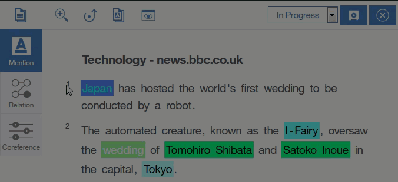

---

copyright:
  years: 2015, 2018
lastupdated: "2018-08-13"

---

{:shortdesc: .shortdesc}
{:new_window: target="_blank"}
{:tip: .tip}
{:pre: .pre}
{:codeblock: .codeblock}
{:screen: .screen}
{:javascript: .ph data-hd-programlang='javascript'}
{:java: .ph data-hd-programlang='java'}
{:python: .ph data-hd-programlang='python'}
{:swift: .ph data-hd-programlang='swift'}

# How to define attributes for an entity
{: #entity-gif0}

This graphic illustrates how to assign a subtype attribute to an entity. First, select an entity. Then, you can open the Attribute View. From there, you can edit attributes, and then click the arrow icon to move to the next entity in the document.
{: shortdesc}

## Related tasks

[Annotating entity mentions](/docs/services/knowledge-studio/user-guide.html#wks_haentity)
