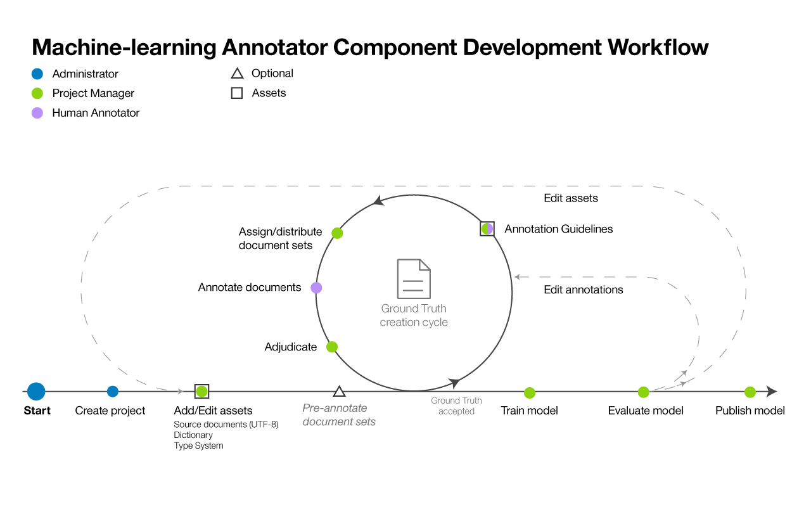

---

copyright:
  years: 2015, 2017
lastupdated: "2017-08-14"

---

{:shortdesc: .shortdesc}
{:new_window: target="_blank"}
{:tip: .tip}
{:pre: .pre}
{:codeblock: .codeblock}
{:screen: .screen}
{:javascript: .ph data-hd-programlang='javascript'}
{:java: .ph data-hd-programlang='java'}
{:python: .ph data-hd-programlang='python'}
{:swift: .ph data-hd-programlang='swift'}

This documentation is for {{site.data.keyword.knowledgestudiofull}} on {{site.data.keyword.IBM}} Marketplace. To see the documentation for the new version of {{site.data.keyword.knowledgestudioshort}} on {{site.data.keyword.cloud_notm}}, [click this link ](https://{DomainName}/docs/services/watson-knowledge-studio/ml-annotator.html){: new_window}.
{: tip}

# Machine-learning model creation workflow
{: #ml_annotator}

Create a machine-learning annotator that trains a model you can use to identify entities, coreferences, and relationships of interest in new documents.
{: shortdesc}

Understand the typical workflow for creating a machine-learning annotator component in {{site.data.keyword.watson}}&trade; {{site.data.keyword.knowledgestudioshort}}.

All the steps are performed by the project manager, except for the *Annotate documents* step, which is performed by the human annotator. Because human annotators are often subject matter experts, they might be consulted during the creation of project resources, such as the type system, also.

<table cellpadding="4" cellspacing="0" summary="Creating and refining an annotator component" border="1" class="simpletable"><tr class="sthead"><th valign="bottom" align="left" id="d14771e70" class="stentry thleft thbot">Step</th>
<th valign="bottom" align="left" id="d14771e72" class="stentry thleft thbot">Description</th>
</tr>
<tr class="strow"><td valign="top" headers="d14771e70" class="stentry">
Create a project. 
</td>
<td valign="top" headers="d14771e72" class="stentry">
See [Creating a project](/docs/services/knowledge-studio/create-project.html). A project contains the resources
that are used to create the annotator component, including:
<dl class="dl"><dt class="dt dlterm">Type system</dt>
<dd class="dd">
Import or create the type system, and define the entity types and relation types that human
annotators can apply when annotating text. The annotator process manager typically works with
subject matter experts for your domain to define the type system. See [Establishing a type system](/docs/services/knowledge-studio/typesystem.html)
</dd>
<dt class="dt dlterm">Source documents</dt>
<dd class="dd">
Create a corpus by importing sample documents that are representative of your domain content
into the project. See [Adding documents for annotation](/docs/services/knowledge-studio/document-for-annotation.html). Partition the corpus into document sets,
specify the percentage of documents that are shared among all document sets, and assign the document
sets to human annotators. See [Creating and assigning annotation sets](/docs/services/knowledge-studio/documents-for-annotation.html#wks_projdocsets).
</dd>
<dt class="dt dlterm">Dictionaries</dt>
<dd class="dd">
Import or create dictionaries for annotating text. You can choose to manually add dictionary
entries or import entries from a file, and then edit the entries. See [Creating dictionaries](/docs/services/knowledge-studio/dictionaries.html).
</dd>
</dl>
</td>
</tr>
<tr class="strow"><td valign="top" headers="d14771e70" class="stentry">
<strong class="ph b">Optional</strong>: Pre-annotate documents 
</td>
<td valign="top" headers="d14771e72" class="stentry">
Pre-annotate documents according to the terms in the project dictionaries,
or based on rules that you define. See [Bootstrapping annotation](/docs/services/knowledge-studio/preannotation.html#wks_preannotate).
</td>
</tr>
<tr class="strow"><td valign="top" headers="d14771e70" class="stentry">
Annotate documents
</td>
<td valign="top" headers="d14771e72" class="stentry"><ol class="ol"><li class="li">
The project manager assigns annotation tasks to human annotators, configures the inter-annotator
agreement threshold, and provides annotation guidelines for the human annotators to follow. See
[Creating an annotation task](/docs/services/knowledge-studio/annotate-documents.html#wks_hatask).
</li>
<li class="li">
Human annotators use the Ground Truth Editor to
manually annotate documents. A human annotator identifies mentions of interest in your domain
content and labels them with entity types. The human annotator also identifies relationships between
mentions (for example, Mary is an employee of IBM) and how the mentions co-reference the same entity
(such as an occurrence of "she" that refers to Mary). Refer to the [User Guide: Ground Truth Editor](/docs/services/knowledge-studio/user-guide.html).
</li>
</ol>
</td>
</tr>
<tr class="strow"><td valign="top" headers="d14771e70" class="stentry">
Adjudicate and promote documents
</td>
<td valign="top" headers="d14771e72" class="stentry">
Accept or reject the ground truth that was generated by human annotators, and adjudicate
any annotation differences to resolve conflicts. Evaluating the accuracy and consistency of the
human annotation effort might be the responsibility of a senior human annotator or a user with
stronger subject matter experience than the project manager. See [Adjudication](/docs/services/knowledge-studio/build-groundtruth.html#wks_haperform).
</td>
</tr>
<tr class="strow"><td valign="top" headers="d14771e70" class="stentry">
Train the model
</td>
<td valign="top" headers="d14771e72" class="stentry">
Create the machine-learning annotator component. See [Creating a machine-learning annotator component](/docs/services/knowledge-studio/train-ml.html#wks_madocsets).
</td>
</tr>
<tr class="strow"><td valign="top" headers="d14771e70" class="stentry">
Evaluate the model.
</td>
<td valign="top" headers="d14771e72" class="stentry">
Evaluate the accuracy of the annotator component. See [Evaluating annotations added by the annotator component](/docs/services/knowledge-studio/train-ml.html#wks_matest). Depending on annotator accuracy, this step might result in the
need to repeat earlier steps again and again until optimal accuracy is achieved. See [Analyzing machine-learning model performance](/docs/services/knowledge-studio/evaluate-ml.html) for ideas about what to update based on common
performance issues.
</td>
</tr>
<tr class="strow"><td valign="top" headers="d14771e70" class="stentry">
Publish the model.
</td>
<td valign="top" headers="d14771e72" class="stentry">
Export or deploy the model. See [Using the machine-learning model](/docs/services/knowledge-studio/publish-ml.html).
</td>
</tr>
</table>
