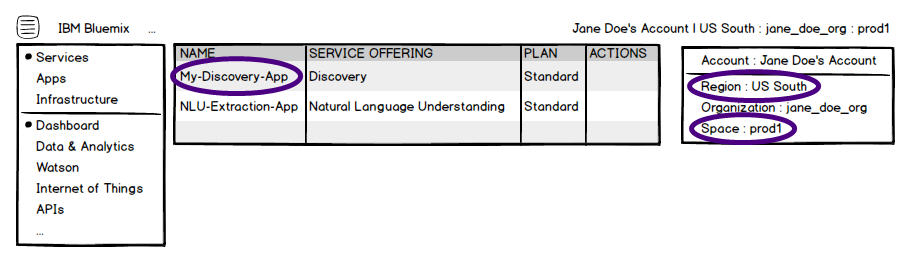

---

copyright:
  years: 2015, 2018
lastupdated: "2018-08-13"

---

{:shortdesc: .shortdesc}
{:new_window: target="_blank"}
{:tip: .tip}
{:pre: .pre}
{:codeblock: .codeblock}
{:screen: .screen}
{:javascript: .ph data-hd-programlang='javascript'}
{:java: .ph data-hd-programlang='java'}
{:python: .ph data-hd-programlang='python'}
{:swift: .ph data-hd-programlang='swift'}

This documentation is for {{site.data.keyword.knowledgestudiofull}} on {{site.data.keyword.IBM}} Marketplace. To see the documentation for the new version of {{site.data.keyword.knowledgestudioshort}} on {{site.data.keyword.cloud_notm}}, [click this link ](https://{DomainName}/docs/services/watson-knowledge-studio/publish-ml.html){: new_window}.
{: tip}

# Using the machine-learning model
{: #publish-ml}

Leverage a machine-learning model that you trained with {{site.data.keyword.watson}}&trade; {{site.data.keyword.knowledgestudioshort}} by making it available to other {{site.data.keyword.watson}} applications.
{: shortdesc}

You can deploy or export a machine-learning annotator. A dictionary pre-annotator can only be used to pre-annotate documents within {{site.data.keyword.watson}} {{site.data.keyword.knowledgestudioshort}}.

Before a model can be deployed for use by a service, you must have a subscription to the service. {{site.data.keyword.IBM_notm}} {{site.data.keyword.watson}} services are hosted on {{site.data.keyword.Bluemix_short}}, which is the cloud platform for {{site.data.keyword.IBM_notm}}. See [What is {{site.data.keyword.Bluemix_notm}}? ](https://{DomainName}/docs/overview/whatisbluemix.html){: new_window} for more information about the platform. To subscribe to one of the {{site.data.keyword.IBM_notm}} {{site.data.keyword.watson}} services, create an account from the [{{site.data.keyword.Bluemix_notm}} ](https://{DomainName}/){: new_window} website.

For some of the services, you must know details about the service instance that you plan to deploy to, such as the {{site.data.keyword.Bluemix_notm}} space name and service instance name. The space and instance name information is available from the {{site.data.keyword.Bluemix_notm}} Services page. The following illustration highlights where you can find the information after you create an account and log in to {{site.data.keyword.Bluemix_notm}}. For example, in this illustration the instance name is *My-{{site.data.keyword.discoveryshort}}-App*, the region name is *US South*, and the space name is *prod1*.



You can also pre-annotate new documents with the machine-learning annotator component. See [Pre-annotating documents with a machine-learning annotator](/docs/services/knowledge-studio/preannotation.html#wks_preannotsire) for details.

## Deploying a machine-learning annotator to IBM Watson Discovery
{: #wks_madiscovery}

When you are satisfied with the performance of the annotator component, you can deploy a version of it to {{site.data.keyword.IBM_notm}} {{site.data.keyword.watson}} {{site.data.keyword.discoveryshort}}. This feature enables your applications to use the deployed machine-learning model to enrich the insights that you get from your data to include the recognition of concepts and relations that are relevant to your domain.

### Before you begin

You must have administrative access to a {{site.data.keyword.watson}} {{site.data.keyword.discoveryshort}} service instance, and know the {{site.data.keyword.Bluemix_notm}} space and instance names that are associated with it.

### About this task

When you deploy the machine-learning annotator, you select the version of it that you want to deploy.

### Procedure

To deploy a machine-learning annotator to {{site.data.keyword.watson}} {{site.data.keyword.discoveryshort}}, complete the following steps:

1. Log in as a {{site.data.keyword.watson}} {{site.data.keyword.knowledgestudioshort}} administrator or project manager, open the **Annotator Component** page, and click **Details** on the Machine-learning annotator tile.
1. On the **Versions** tab, choose the version of the model that you want to deploy.

    If there is only one working version of the model, create a snapshot of the current model. This versions the model, which enables you to deploy one version, while you continue to improve the current version. The option to deploy does not appear until you create at least one version.

1. Click **Deploy**, choose to deploy it to {{site.data.keyword.discoveryshort}}, and then click **Next**.
1. Select the {{site.data.keyword.Bluemix_notm}} space and instance. If necessary, select a different region.
1. Click **Deploy**.
1. The deployment process might take a few minutes. To check the status of the deployment, click **Status** on the **Versions** tab next to the version that you deployed.

    If the model is still being deployed, the status indicates "publishing". After deployment completes, the status changes to "available" if the deployment was successful, or "error" if problems occurred.

    Once available, make a note of the model ID (model_id). You will provide this ID to the {{site.data.keyword.discoveryshort}} service to enable the service to use your custom model.

### What to do next

To use the deployed model, you must provide the model ID when it is requested during the {{site.data.keyword.discoveryshort}} service enrichment configuration process. For more details, see the [{{site.data.keyword.discoveryshort}} service documentation ](http://www.ibm.com/watson/developercloud/doc/discovery/integrate-wks.shtml){: new_window}.

## Deploying a machine-learning annotator to IBM Watson Natural Language Understanding
{: #wks_manlu}

When you are satisfied with the performance of the annotator component, you can deploy a version of it to {{site.data.keyword.IBM_notm}} {{site.data.keyword.watson}} {{site.data.keyword.nlushort}}. This feature enables your applications to use the deployed machine-learning annotator to analyze semantic features of text input, including entities and relations.

### Before you begin

You must have a {{site.data.keyword.nlushort}} service to deploy to. And you must know the {{site.data.keyword.Bluemix_notm}} space and instance names that are associated with the service. If you do not remember the space or instance names, find them by logging in to {{site.data.keyword.Bluemix_notm}}. If you do not have an {{site.data.keyword.Bluemix_notm}} account, sign up for an account.

### About this task

When you deploy the machine-learning annotator, you select the version of it that you want to deploy.

### Procedure

To deploy a machine-learning annotator to the {{site.data.keyword.nlushort}} service, complete the following steps:

1. Log in as a {{site.data.keyword.watson}} {{site.data.keyword.knowledgestudioshort}} administrator or project manager, open the **Annotator Component** page, and click **Details**.
1. On the **Versions** tab, choose the version of the model that you want to deploy.

    If there is only one working version of the model, create a snapshot of the current model. This versions the model, which enables you to deploy one version, while you continue to improve the current version. The option to deploy does not appear until you create at least one version.

1. Click **Deploy**, choose to deploy it to {{site.data.keyword.nlushort}}, and then click **Next**.
1. Select the {{site.data.keyword.Bluemix_notm}} space and instance. If necessary, select a different region.
1. Click **Deploy**.
1. The deployment process might take a few minutes. To check the status of the deployment, click **Status** on the **Versions** tab next to the version that you deployed. If the model is still being deployed, the status indicates "publishing". After deployment completes, the status changes to "available" if the deployment was successful, or "error" if problems occurred.

    Once available, make a note of the model ID (model_id). You will provide this ID to the {{site.data.keyword.nlushort}} service to enable the service to use your custom model.

### What to do next

To use the deployed model, you must specify the model ID of your custom model in the `entities.model` parameter.

You can use the model with the {{site.data.keyword.nlushort}} `GET /analyze` request to extract the following features:

- **entities**

    The following command finds the entities that are present in the sentence that is passed by using the text parameter:

    ```bash
    curl -G -u "3330af09-4b22-4f2d-a54c-1cb099df1fa8":"338rTJSvPVqeG"
    -d "version=2016-05-17"
    -d "text=Vehicle%201%2C%20a%201995%20Honda%20Civic%20was%20traveling%20north
    %20on%20a%20two%20lane%20undivided%20roadway%2C%20negotiating%20a%20curve%20to
    %20the%20left%20on%20an%20upgrade."
    -d "features=entities"
    -d "entities.model=10:7abc4c2f-5846-3334-b8f7-af5a6fad3398"
    "https://gateway.watsonplatform.net/natural-language-understanding/api/v1/analyze" -k
    ```
    {: pre}

    The service returns a JSON object of instances that it finds of entity types that are defined in the custom model:

    ```javascript
    {
      "language": "en",
      "entities": [
        {
          "type": "MANUFACTURER",
          "text": "Honda",
          "count": 1
        },
        {
          "type": "MODEL",
          "text": "Civic",
          "count": 1
        },
        {
          "type": "VEHICLE",
          "text": "Vehicle 1",
          "count": 1
        },
        {
          "type": "STRUCTURE",
          "text": "two lane undivided roadway",
          "count": 1
        },
        {
          "type": "STRUCTURE",
          "text": "curve",
          "count": 1
        },
        {
          "type": "MODEL_YEAR",
          "text": "1995",
          "count": 1
        },
        {
          "type": "CONDITION",
          "text": "negotiating",
          "count": 1
        }
      ],
      "language": "en"
    }
    ```
    {: codeblock}

- **relations**

    The following command finds the relationships that are present in the sentence that is passed by using the text parameter:

    ```bash
    curl -G -u "3330af09-4b22-4f2d-a54c-1cb099df1fa8":"338rTJSvPVqeG"
    -d "version=2016-05-17"
    -d "text=Vehicle%201%2C%20a%201995%20Honda%20Civic%20was%20traveling%20north
    %20on%20a%20two%20lane%20undivided%20roadway%2C%20negotiating%20a%20curve%20to
    %20the%20left%20on%20an%20upgrade."
    -d "features=relations"
    -d "entities.model=10:7abc4c2f-5846-3334-b8f7-af5a6fad3398"
    "https://gateway.watsonplatform.net/natural-language-understanding/api/v1/analyze" -k
    ```
    {: pre}

    The service returns a JSON object of instances that it finds of relation types that are defined in the custom model:

    ```javascript
    {
      "relations": [
        {
          "type": "timeOf",
          "sentence": "Vehicle 1, a 1995 Honda Civic was traveling north
           on a two lane undivided roadway, negotiating a curve to
           the left on an upgrade.",
          "score": 0.954254,
          "arguments": [
            {
              "text": "1995",
              "entities": [
                {
                  "type": "Date",
                  "text": "1995"
                }
              ]
            },
            {
              "text": "Honda Civic",
              "entities": [
                {
                  "type": "SportingEvent",
                  "text": "Honda Civic"
                }
              ]
            }
          ]
        },
        {
          "type": "locatedAt",
          "sentence": "Vehicle 1, a 1995 Honda Civic was traveling north
           on a two lane undivided roadway, negotiating a curve to
           the left on an upgrade.",
          "score": 0.40592,
          "arguments": [
            {
              "text": "negotiating",
              "entities": [
                {
                  "type": "EventMeeting",
                  "text": "negotiating"
                }
              ]
            },
            {
              "text": "roadway",
              "entities": [
                {
                  "type": "Facility",
                  "text": "roadway"
                }
              ]
            }
          ]
        }
      ],
      "language": "en"
    }
    ```
    {: codeblock}

See the [{{site.data.keyword.nlushort}} documentation ](https://www.ibm.com/watson/developercloud/doc/natural-language-understanding/index.html){: new_window} for more details.

## Leveraging a machine-learning annotator in IBM Watson Explorer
{: #wks_maexport}

Export the trained machine-learning annotator so it can be used in {{site.data.keyword.IBM_notm}} {{site.data.keyword.watson}} Explorer.

### Before you begin

If you choose to identify relation types and annotate them, then you must define at least two relation types, and annotate instances of the relationships in the ground truth before you export the model. Defining and annotating only one relation type can cause subsequent issues in {{site.data.keyword.IBM_notm}} {{site.data.keyword.watson}} Explorer, release 11.0.1.0.

### About this task

Now that the machine learning annotator is trained to recognize entities and relationships for a specific domain, you can leverage it in {{site.data.keyword.IBM_notm}} {{site.data.keyword.watson}} Explorer.

Click [this link ](https://www.youtube.com/watch?v=1VoS-xczBow&amp;feature=youtu.be){: new_window} to watch a less than 2 minute video that illustrates how to export a model and use it in {{site.data.keyword.IBM_notm}} {{site.data.keyword.watson}} Explorer.

### Procedure

To leverage a machine-learning annotator in {{site.data.keyword.IBM_notm}} {{site.data.keyword.watson}} Explorer, complete the following steps.

1. Log in to {{site.data.keyword.watson}} {{site.data.keyword.knowledgestudioshort}} as an administrator or project manager, open the **Annotator Component** page, and click **Export** on the Machine Learning annotator component.

    If you have a free plan subscription, no **Export** option is available.

    The model is saved as a ZIP file, and you are prompted to download the file.

1. Download the file to your local system.
1. From the {{site.data.keyword.IBM_notm}} {{site.data.keyword.watson}} Explorer application, import the model.

    You can then map the model to a machine-learning annotator in {{site.data.keyword.watson}} Explorer Content Analytics. After you perform the mapping step, when you crawl documents, the annotator finds instances of the entities and relations that your model understands. To learn how to import and configure the model in {{site.data.keyword.IBM_notm}} {{site.data.keyword.watson}} Explorer, see the technical document that describes the integration: [http://www.ibm.com/support/docview.wss?uid=swg27048147 ](http://www.ibm.com/support/docview.wss?uid=swg27048147){: new_window}.

#### Related tasks

[Exporting analyzed documents from {{site.data.keyword.watson}} Explorer Content Analytics](/docs/services/knowledge-studio/preannotation.html#wks_uimawexca)
