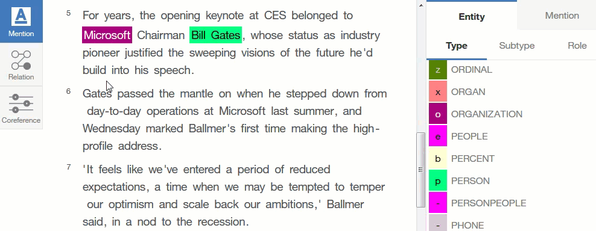

---

copyright:
  years: 2015, 2018
lastupdated: "2018-08-13"

---

{:shortdesc: .shortdesc}
{:new_window: target="_blank"}
{:tip: .tip}
{:pre: .pre}
{:codeblock: .codeblock}
{:screen: .screen}
{:javascript: .ph data-hd-programlang='javascript'}
{:java: .ph data-hd-programlang='java'}
{:python: .ph data-hd-programlang='python'}
{:swift: .ph data-hd-programlang='swift'}

# How to annotate a relation type
{: #relation-gif}

This graphic illustrates how to annotate a relation type.
{: shortdesc}

## Related tasks

[Annotating relations](/docs/services/knowledge-studio/user-guide.html#wks_harelation)
