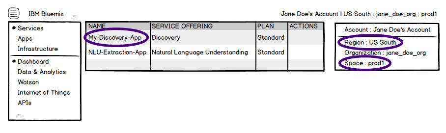

---

copyright:
  years: 2015, 2018
lastupdated: "2018-08-14"

---

{:shortdesc: .shortdesc}
{:new_window: target="_blank"}
{:tip: .tip}
{:pre: .pre}
{:codeblock: .codeblock}
{:screen: .screen}
{:javascript: .ph data-hd-programlang='javascript'}
{:java: .ph data-hd-programlang='java'}
{:python: .ph data-hd-programlang='python'}
{:swift: .ph data-hd-programlang='swift'}

This documentation is for {{site.data.keyword.knowledgestudiofull}} on {{site.data.keyword.IBM}} Marketplace. To see the documentation for the new version of {{site.data.keyword.knowledgestudioshort}} on {{site.data.keyword.cloud_notm}}, [click this link ](https://{DomainName}/docs/services/watson-knowledge-studio/rule-annotator-model-use.html){: new_window}.
{: tip}

# Using the rule-based model
{: #wks_rule_publish}

Leverage a rule-based annotator that you created with {{site.data.keyword.watson}} {{site.data.keyword.knowledgestudioshort}} by making it available to other {{site.data.keyword.watson}} applications.
{: shortdesc}

**Attention**: You can deploy a rule-based model to make it available for use in these services as an [experimental](/docs/services/knowledge-studio/troubleshooting.html#experimental) feature.

Before a model can be deployed for use by a service, you must have a subscription to the service. {{site.data.keyword.IBM_notm}} {{site.data.keyword.watson}} services are hosted on {{site.data.keyword.Bluemix_notm}}, which is the cloud platform for {{site.data.keyword.IBM_notm}}. See [What is {{site.data.keyword.Bluemix_notm}}? ](https://{DomainName}/docs/overview/whatisbluemix.html){: new_window} for more information about the platform. To subscribe to one of the {{site.data.keyword.IBM_notm}} {{site.data.keyword.watson}} services, create an account from the [{{site.data.keyword.Bluemix_notm}} ](https://{DomainName}/){: new_window} website.

For some of the services, you must know details about the service instance that you plan to deploy to, such as the {{site.data.keyword.Bluemix_notm}} space name and service instance name. The space and instance name information is available from the {{site.data.keyword.Bluemix_notm}} services page. The following illustration highlights where you can find the information after you create an account and log in to {{site.data.keyword.Bluemix_notm}}. For example, in this illustration the instance name is *My-{{site.data.keyword.discoveryshort}}-App*, the region name is *US South*, and the space name is *prod1*.

You can also pre-annotate new documents with the Rule annotator component. See [Pre-annotating documents with the rule annotator](/docs/services/knowledge-studio/preannotation.html#wks_preannotrule) for details.

## Deploying a rule-based annotator to IBM Watson Discovery
{: #wks_rule_discovery}

Deploy the model to enable an application that uses the {{site.data.keyword.discoveryshort}} service to use the rule-based model to find and extract entities during document enrichment.

**Attention**: This is currently an [experimental](/docs/services/knowledge-studio/troubleshooting.html#experimental) feature of the service.

### Before you begin

You must have administrative access to a {{site.data.keyword.watson}} {{site.data.keyword.discoveryshort}} service instance, and know the {{site.data.keyword.Bluemix_notm}} space and instance names that are associated with it.

### Procedure

To deploy a rule-based model to {{site.data.keyword.watson}} {{site.data.keyword.discoveryshort}} , complete the following steps:

1. Log in as a {{site.data.keyword.watson}} {{site.data.keyword.knowledgestudioshort}} administrator or project manager, open the **Annotator Component** page, and click **Details** on the Rule annotator tile.
1. On the **Versions** tab, choose the version of the model that you want to deploy.

    If there is only one working version of the model, save the current model for deployment by clicking **Save for Deployment**. This versions the model, which enables you to deploy one version, while you continue to improve the current version. Saving the version might take a few minutes. The option to deploy does not appear until after the version is created.

1. Click **Deploy**, choose to deploy it to {{site.data.keyword.discoveryshort}}, and then click **Next**.
1. Provide the {{site.data.keyword.Bluemix_notm}} space and instance. If necessary, select a different region.
1. Click **Deploy**.
1. The deployment process might take a few minutes. To check the status of the deployment, click **Status** on the **Versions** tab next to the version that you deployed.

    If the model is still being deployed, the status indicates "publishing". After deployment completes, the status changes to "available" if the deployment was successful, or "error" if problems occurred.

    Once available, make a note of the model ID (model_id). You will provide this ID to the {{site.data.keyword.discoveryshort}} service to enable the service to use your custom model.

### What to do next

To use the deployed model, you must provide the model ID when it is requested during the {{site.data.keyword.discoveryshort}} service enrichment configuration process.

## Deploying a rule-based annotator to IBM Watson Natural Language Understanding
{: #wks_rule_nlu}

Deploy the rule-based model to enable an application that uses the {{site.data.keyword.nlushort}} service to use the model to find and extract entities that are relevant to your domain.

**Attention**: This is currently an [experimental](/docs/services/knowledge-studio/troubleshooting.html#experimental) feature of the service.

### Before you begin

You must have administrative access to a {{site.data.keyword.nlushort}} service instance, and know the {{site.data.keyword.Bluemix_notm}} space and instance names that are associated with it.

### Procedure

To deploy a rule-based model to {{site.data.keyword.nlushort}} , complete the following steps:

1. Log in as a {{site.data.keyword.watson}} {{site.data.keyword.knowledgestudioshort}} administrator or project manager, open the **Annotator Component** page, and click **Details** on the Rule annotator tile.
1. On the **Versions** tab, choose the version of the model that you want to deploy.

    If there is only one working version of the model, save the current model for deployment by clicking **Save for Deployment**. This versions the model, which enables you to deploy one version, while you continue to improve the current version. Saving the version might take a few minutes. The option to deploy does not appear until after the version is created.

1. Click **Deploy**, choose to deploy it to {{site.data.keyword.nlushort}}, and then click **Next**.
1. Provide the {{site.data.keyword.Bluemix_notm}} space and instance. If necessary, select a different region.
1. Click **Deploy**.
1. The deployment process might take a few minutes. To check the status of the deployment, click **Status** on the **Versions** tab next to the version that you deployed.

    If the model is still being deployed, the status indicates "publishing". After deployment completes, the status changes to "available" if the deployment was successful, or "error" if problems occurred.

    Once available, make a note of the model ID (model_id). You will provide this ID to the {{site.data.keyword.nlushort}} service to enable the service to use your custom model.

### What to do next

To use the deployed model, you must specify the model ID of your custom model in the `entities.model` parameter.

You can use the model with the {{site.data.keyword.nlushort}} `GET /analyze` request to extract entities.

See the [{{site.data.keyword.nlushort}} documentation ](https://www.ibm.com/watson/developercloud/doc/natural-language-understanding/index.html){: new_window} for more details.

## Leveraging a rule-based annotator in IBM Watson Explorer
{: #wks_rule_export}

Export the PEAR file that is produced when the rule annotator is created so it can be used in {{site.data.keyword.IBM_notm}} {{site.data.keyword.watson}} Explorer.

### Procedure

To leverage a rule-based model in {{site.data.keyword.IBM_notm}} {{site.data.keyword.watson}} Explorer , complete the following steps.

1. Log in to {{site.data.keyword.watson}} {{site.data.keyword.knowledgestudioshort}} as an administrator or project manager, open the **Annotator Component** page, and click **Export** on the Rule annotator component.

    If you have a free plan subscription, no **Export** option is available.

    The model is saved as a PEAR file, and you are prompted to download the file. A PEAR (Processing Engine ARchive) file is the UIMA standard packaging format for UIMA components. The model is saved in PEAR format so it can be distributed and reused within UIMA applications.

1. Download the file to your local system.
1. From the {{site.data.keyword.IBM_notm}} {{site.data.keyword.watson}} Explorer application, import the PEAR file.
