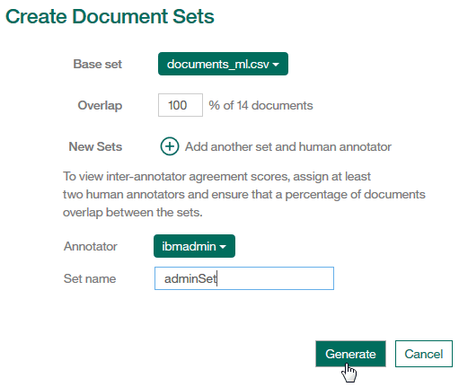
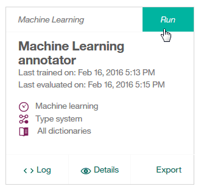
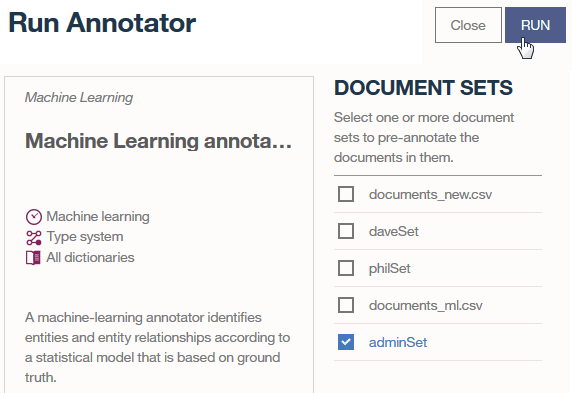

---

copyright:
  years: 2015, 2017
lastupdated: "2017-10-24"

---

{:shortdesc: .shortdesc}
{:new_window: target="_blank"}
{:tip: .tip}
{:pre: .pre}
{:codeblock: .codeblock}
{:screen: .screen}
{:javascript: .ph data-hd-programlang='javascript'}
{:java: .ph data-hd-programlang='java'}
{:python: .ph data-hd-programlang='python'}
{:swift: .ph data-hd-programlang='swift'}

This documentation is for {{site.data.keyword.knowledgestudiofull}} on {{site.data.keyword.IBM}} Marketplace. To see the documentation for the new version of {{site.data.keyword.knowledgestudioshort}} on {{site.data.keyword.cloud_notm}}, [click this link ](https://console.bluemix.net/docs/services/watson-knowledge-studio/tutorials-bootstrap-annotation.html){: new_window}.
{: tip}

# Tutorial: Bootstrapping annotation
{: #wks_tutboot_intro}

This tutorial helps you understand how to pre-annotate documents, which simplifies the annotation job of human annotators.
{: shortdesc}

## Learning objectives

After you complete this tutorial, you will know how to pre-annotate documents with a machine-learning annotator.

This tutorial should take approximately 5 minutes to finish. If you explore other concepts related to this tutorial, it could take longer to complete.

## Prerequisites

- You're using a supported browser. For information, see [Browser requirements](/docs/services/knowledge-studio/system-requirements.html).
- You successfully completed [Tutorial: Creating a project](/docs/services/knowledge-studio/tutorials-create-project.html) and [Tutorial: Creating a machine-learning model](/docs/services/knowledge-studio/tutorials-create-ml-model.html).
- You must have at least one user ID in either the ADMIN or PROJECTMANAGER role. For information about user roles, see [Assembling a team](/docs/services/knowledge-studio/team.html).

## Results

After completing this tutorial, you will have a set of partially-annotated documents. You can assign the documents to human annotators who can now finish the annotation job.

## Lesson 1: Pre-annotating new documents with a machine-learning annotator
{: #wks_tutboot_ml}

In this lesson, you will learn how to use a machine-learning annotator to pre-annotate documents in {{site.data.keyword.watson}} {{site.data.keyword.knowledgestudioshort}}.

### About this task

After you train a machine-learning annotator, you can use it to pre-annotate new documents that you add to the corpus.

> **Attention:** Do not run a pre-annotator on documents that have been annotated by humans, but not been added to the ground truth yet. If you do, all current annotations will be stripped from the documents.

In this tutorial, you can add a second set of documents by using the `documents-ml.csv` file. Do not re-add the `documents-new.csv` file, since this addition would result in duplicate documents in the ground truth. Duplication causes the following problems:

- If annotations on each document do not match, they lower the quality of the machine-learning annotator.
- If annotations on each document match, they over-train the machine-learning annotator on the duplicated files.

### Procedure

1. Log in to {{site.data.keyword.watson}} {{site.data.keyword.knowledgestudioshort}} as the administrator.
1. Add more documents to the project. You can use the <a target="_blank" href="https://watson-developer-cloud.github.io/doc-tutorial-downloads/knowledge-studio/documents-ml.csv" download>`documents-ml.csv`</a> file.

    For more information, see [Creating a project > Adding a dictionary](/docs/services/knowledge-studio/tutorials-create-project.html#wks_tutless4).

1. Create an annotation set.

    Assign the annotation set to one or more human annotators. In this tutorial, the annotation set is assigned to a single user, the administrator. For more information about creating annotation sets, see [Creating a machine learning model > Pre-annotating with a dictionary-based annotator](/docs/services/knowledge-studio/tutorials-create-ml-model.html#wks_tutless_ml3).

    For example, on the Documents page, create the following document set:

    *Figure 13. The Create Document Sets page*

    

1. Select the Annotator Component page and click **Run** in the machine-learning annotator section.

    *Figure 14. Running a machine-learning annotator*

    

1. Select the document set that you added to the corpus and click **Run**.

    *Figure 15. The Run Annotator page*

    

1. After the pre-annotation is complete, you can create a human annotation task and annotate the new documents.

    For more information, see [Creating a machine-learning model > Creating an annotation task](/docs/services/knowledge-studio/tutorials-create-ml-model.html#wks_tutless_ml4) and [Creating a machine-learning model > Annotating documents](/docs/services/knowledge-studio/tutorials-create-ml-model.html#wks_tutless_ml5).

    In this situation, human annotation requires less time because you used the machine-learning annotator to pre-annotate the documents.

### Results

By using your machine-learning annotator to pre-annotate new document sets, you can expedite human annotation tasks for those documents.
