---

copyright:
  years: 2015, 2017
lastupdated: "2017-10-24"

---

{:shortdesc: .shortdesc}
{:new_window: target="_blank"}
{:tip: .tip}
{:pre: .pre}
{:codeblock: .codeblock}
{:screen: .screen}
{:javascript: .ph data-hd-programlang='javascript'}
{:java: .ph data-hd-programlang='java'}
{:python: .ph data-hd-programlang='python'}
{:swift: .ph data-hd-programlang='swift'}

This documentation is for {{site.data.keyword.knowledgestudiofull}} on {{site.data.keyword.IBM}} Marketplace. To see the documentation for the new version of {{site.data.keyword.knowledgestudioshort}} on {{site.data.keyword.cloud_notm}}, [click this link ](https://console.bluemix.net/docs/services/watson-knowledge-studio/tutorials-create-ml-model.html){: new_window}.
{: tip}

# Tutorial: Creating a machine-learning model
{: #wks_tutml_intro}

This tutorial helps you understand the process for building a machine-learning model that you can deploy and use with other {{site.data.keyword.watson}} services.
{: shortdesc}

## Learning objectives

After you complete the lessons in this tutorial, you will know how to perform the following tasks:

- Create document sets
- Pre-annotate documents
- Create tasks for human annotators
- Analyze inter-annotator agreement and adjudicate conflicts in annotated documents
- Create machine-learning annotators

This tutorial should take approximately 60 minutes to finish. If you explore other concepts related to this tutorial, it could take longer to complete.

## Prerequisites

- You're using a supported browser. For information, see [Browser requirements](/docs/services/knowledge-studio/system-requirements.html).
- You successfully completed [Tutorial: Creating a project](/docs/services/knowledge-studio/tutorials-create-project.html).
- You must have at least one user ID in either the ADMIN or PROJECTMANAGER role.

    > **Note:** If possible, use multiple user IDs for the machine-learning annotator tasks in this tutorial (one ADMIN or PROJECTMANAGER user ID, and at least two HUMANANNOTATOR user IDs). Using multiple user IDs provides the most realistic simulation of an actual {{site.data.keyword.IBM_notm}} {{site.data.keyword.watson}}™ {{site.data.keyword.knowledgestudioshort}} project, where a project manager must coordinate and adjudicate annotation performed by multiple human annotators. However, if you have access to only a single user ID, you can still simulate most parts of the process.

    For information about user roles, see [Assembling a team](/docs/services/knowledge-studio/team.html).

## Results

After completing this tutorial, you will have a custom machine-learning model that you can use with other {{site.data.keyword.watson}} services.

## Lesson 1: Adding documents for annotation
{: #tut_lessml1}

In this lesson, you will learn how to add documents to a project in {{site.data.keyword.watson}} {{site.data.keyword.knowledgestudioshort}} that can be annotated by human annotators.

### About this task

For more information about adding documents, see [Adding documents to a project](/docs/services/knowledge-studio/documents-for-annotation.html#wks_projadd).

### Procedure

1. Download the <a target="_blank" href="https://watson-developer-cloud.github.io/doc-tutorial-downloads/knowledge-studio/documents-new.csv" download>`documents-new.csv`</a> file to your computer. This file contains example documents suitable for importing.
1. Within your project, click **Documents** in the banner or the navigation menu.
1. On the Documents page, click **Import Document Set**.

    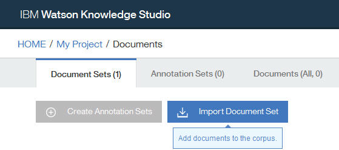

1. Select the `documents-new.csv` file from your computer and click **Import**. The imported file is displayed in the table.

### What to do next

You can now divide the corpus into multiple document sets and assign the document sets to human annotators.

## Lesson 2: Creating annotation sets
{: #wks_tutless_ml2}

In this lesson, you will learn how to create annotation sets in {{site.data.keyword.watson}} {{site.data.keyword.knowledgestudioshort}}.

### About this task

An annotation set is a subset of documents from an imported document set that you assign to a human annotator. The human annotator annotates the documents in the annotation set. To later use inter-annotator scores to compare the annotations that are added by each human annotator, you must assign at least two human annotators to different annotation sets. You must also specify that some percentage of documents overlap between the sets.

> **Note:** In a real project, you would create as many annotation sets as needed, based on the number of human annotators working in the project. In this tutorial, you will create two annotation sets; if you do not have access to multiple user IDs, you can assign both annotation sets to the same user.

For more information about annotation sets, see [Creating and assigning annotation sets](/docs/services/knowledge-studio/documents-for-annotation.html#wks_projdocsets).

### Procedure

1. Within your project, click **Documents** in the banner or the navigation menu.
1. Click **Create Annotation Sets**.

    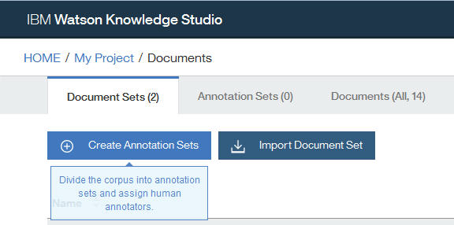

    The Create Annotation Sets window opens. By default, this window shows the base set (containing all documents), as well as fields where you can specify the information for a new annotation set.

1. Click **Add another set and human annotator** to add fields for an additional annotation set. You can click to add as many annotation sets as you want to create; for this tutorial, you need only two.

    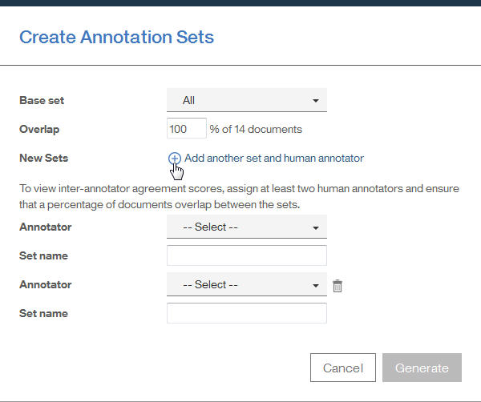

1. In the **Overlap** field, specify `100`. This specifies that you want 100 percent of the documents in the base set to be included in all of the new annotation sets so they can be annotated by all human annotators.
1. For each new annotation set you are creating, specify the required information.

    - In the **Annotator** field, select a human annotator user ID to assign to the new annotation set. Each annotation set should be assigned to a different human annotator.

        > **Note:** If you have only a single administrator ID to use for the tutorial, assign that user to all annotation sets. In a real project, you would have multiple human annotators to assign, but for the tutorial, the administrator can act as human annotator.

    - In the **Set name** field, specify a descriptive name for the annotation set (such as `Set 1` or `DaveSet`).

1. Click **Generate**.

### Results

The new annotation sets are created and now appear in the **Annotation Sets** tab of the Documents page.

## Lesson 3: Pre-annotating with a dictionary-based annotator
{: #wks_tutless_ml3}

In this lesson, you will learn how to use a dictionary-based annotator to pre-annotate documents in {{site.data.keyword.watson}} {{site.data.keyword.knowledgestudioshort}}.

### About this task

Pre-annotating documents is an optional step. However, it is a worthwhile step because it makes the job of human annotators easier later.

For more information about pre-annotation with dictionary-based annotators, see [Pre-annotating documents with the Dictionary pre-annotator](/docs/services/knowledge-studio/preannotation.html#wks_preannot).

### Procedure

1. Within your project, click **Annotator Component** in the banner or the navigation menu.
1. Under the description of the Dictionary annotator type, click **Create this type of pre-annotator**.

    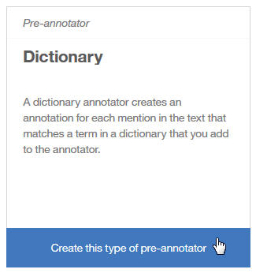

    The Dictionary Mapping window opens.

1. Map the ORGANIZATION entity type to the `Test dictionary` dictionary you created in [Creating a project > Adding a dictionary](/docs/services/knowledge-studio/tutorials-create-project.html#wks_tutless4) of the *Creating a project* tutorial. Click **Edit** for the ORGANIZATION entity type name. Choose the dictionary from the list.

    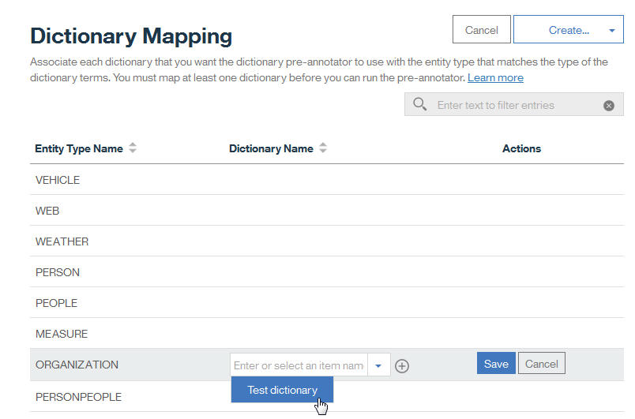

1. Click the plus sign beside the dictionary name to add the mapping, and then click **Save**.

    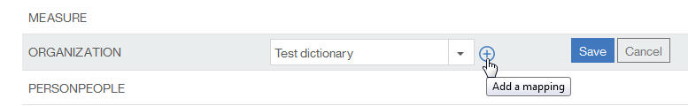

1. Click **Create** and then select **Create &amp; Run** from the drop-down menu.

    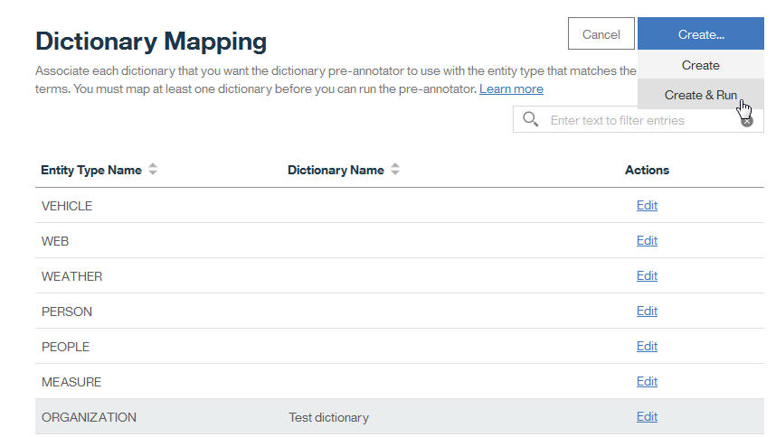

1. On the Run Annotator page, click the check boxes to select both of the annotation sets that you created earlier in the tutorial (not including the base set).
1. Click **Run**.

    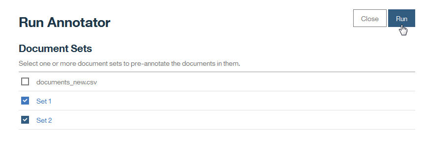

### Results

The documents in the selected sets are pre-annotated using the dictionary annotator you created. The annotator component is added to the Annotator Component page; you can later use the same annotator to pre-annotate additional document sets by clicking **Run**.

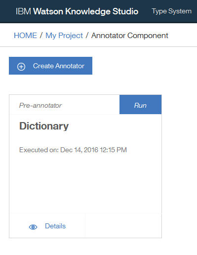

## Lesson 4: Creating an annotation task
{: #wks_tutless_ml4}

In this lesson, you will learn how to use annotation tasks to track the work of human annotators in {{site.data.keyword.watson}} {{site.data.keyword.knowledgestudioshort}}.

### About this task

For more information about annotation tasks, see [Creating an annotation task](/docs/services/knowledge-studio/annotate-documents.html#wks_hatask).

### Procedure

1. Within your project, click **Human Annotation** in the banner or the navigation menu.
1. On the Human Annotation page, click **Add Task**.

    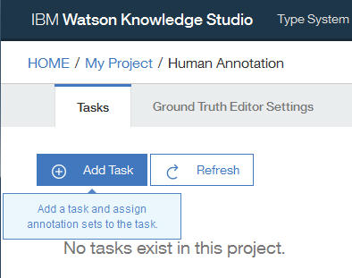

1. Specify the details for the task:

    - In the title field, type `Test`.
    - In the **Deadline** field, select a date in the future.

1. Click **Create**.

    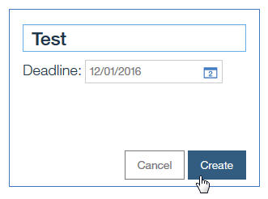

1. In the Add Annotation Sets to Task window, click the check boxes to select both of the annotation sets that you created in [Lesson 3: Pre-annotating with a dictionary-based annotator](/docs/services/knowledge-studio/tutorials-create-ml-model.html#wks_tutless_ml3). This specifies that both annotation sets must be annotated by their assigned human annotators as part of this task.
1. Click **Create Task**.

    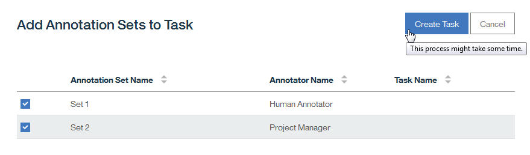

    This screen shot shows human annotators who are named "Human Annotator" and "Project Manager." In a real scenario, these would be real user names. The **Test** task now appears on the Tasks tab of the Human Annotation page.

1. Click the **Test** task to open it. You can use this view to view the progress of human annotation work, calculate the inter-annotator agreement scores, and view overlapping documents to adjudicate annotation conflicts.

    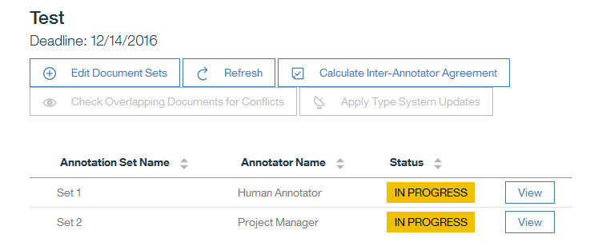

    

## Lesson 5: Annotating documents
{: #wks_tutless_ml5}

In this lesson, you will learn how to use the Ground Truth Editor to annotate documents in {{site.data.keyword.watson}} {{site.data.keyword.knowledgestudioshort}}.

### About this task

For more information about human annotation, see [Annotation with the Ground Truth Editor](/docs/services/knowledge-studio/user-guide.html#wks_hagte).

### Procedure

1. Log in to {{site.data.keyword.watson}} {{site.data.keyword.knowledgestudioshort}} as a human annotator who is assigned to the annotation task you created in [Lesson 4: Creating an annotation task](/docs/services/knowledge-studio/tutorials-create-ml-model.html#wks_tutless_ml4).

    > **Note:** If you have access only to a single administrator ID for this tutorial, you can use that ID to perform human annotation. However, remember that in a real project, human annotation is performed by multiple different users with the HUMANANNOTATOR role.

1. Open the **My project** project.
1. Within the project, click **Human Annotation** in the banner or navigation menu.
1. Open the **Test** annotation task you created in [Lesson 4: Creating an annotation task](/docs/services/knowledge-studio/tutorials-create-ml-model.html#wks_tutless_ml4).
1. Click **Annotate** next to a document set that is assigned to the user ID you are logged in with. The Ground Truth Editor opens, showing you a preview of each document in the document set.

    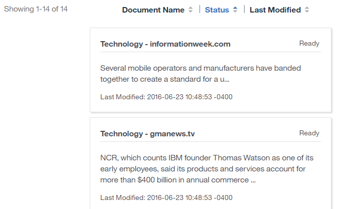

    

1. Scroll to the (*Technology - gmanews.tv*) document and click to open it for annotation. Note that the term `IBM` has already been annotated with the ORGANIZATION entity type; this annotation was added by the dictionary pre-annotator in [Lesson 2: Creating annotation sets](/docs/services/knowledge-studio/tutorials-create-ml-model.html#wks_tutless_ml2). This pre-annotation is correct, so it does not need to be modified.

    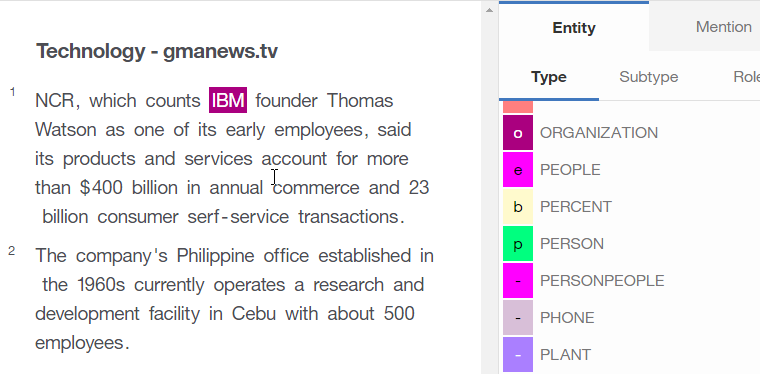

1. Annotate a mention:

    1. Click the **Mentions** icon to begin annotating mentions.
    1. In the document body, select the text `Thomas Watson`.
    1. In the list of entity types, click **PERSON**. The entity type PERSON is applied to the selected mention.

        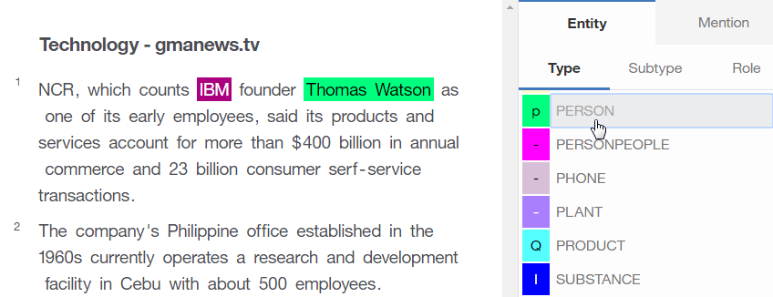

1. Click the **Relations** icon to begin annotating relations.
1. Select the `Thomas Watson` and `IBM` mentions (in that order). To select a mention, click the entity-type label above the text.
1. In the list of relation types, click **founderOf**. The two mentions are connected with a founderOf relationship.

    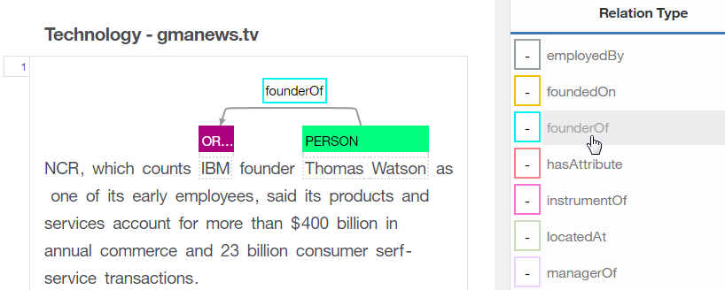

1. Click the Completed option from the menu, and then click the **Save** icon to confirm.
1. Return to the list of documents and click **Submit All** to submit the documents for approval.

    > **Note:** In a real project, you would create many more annotations and complete all of the documents in the set before submitting.

1. Close the Ground Truth Editor.
1. Log in to {{site.data.keyword.watson}} {{site.data.keyword.knowledgestudioshort}} as the human annotator who is assigned to other document set in the annotation task.
1. Repeat the same annotations in the *Technology - gmanews.tv* document, except this time, use the employedBy relation instead of the founderOf releation. (This will help to illustrate inter-annotator agreement in the next lesson.) Complete the annotations and click **Submit All**.

## Lesson 6: Analyzing inter-annotator agreement
{: #wks_tutless_ml6}

In this lesson, you will learn how to compare the work of multiple human annotators in {{site.data.keyword.watson}} {{site.data.keyword.knowledgestudioshort}}.

### About this task

To determine whether different human annotators are annotating overlapping documents consistently, review the inter-annotator agreement (IAA) scores.

{{site.data.keyword.watson}} {{site.data.keyword.knowledgestudioshort}} calculates IAA scores by examining all overlapping documents in all document sets in the task, regardless of the status of the document sets. The IAA scores show how different human annotators annotated mentions, relations, and coreference chains. It is a good idea to check IAA scores periodically and verify that human annotators are consistent with each other.

In this tutorial, the human annotators submitted all the document sets for approval. If the inter-annotator agreement scores are acceptable, you can approve the document sets. If you reject a document set, it is returned to the human annotator for improvement.

### Procedure

1. Log in to {{site.data.keyword.watson}} {{site.data.keyword.knowledgestudioshort}} as the administrator and go to the annotation task. You can see that the document sets are submitted. Click **Calculate IAA**.

    *Figure 1. Calculating IAA scores on the **Human Annotation** &gt; **Tasks** page*

    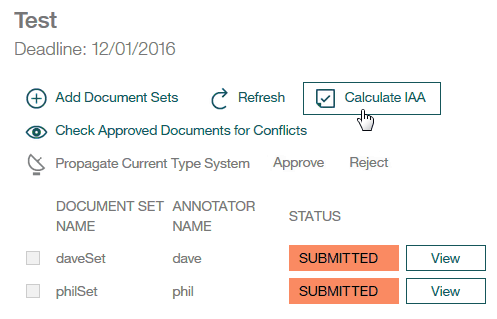

1. View IAA scores for mention, relations, and coreference chains by clicking the first drop-down. You can also view agreement by human annotator pairs. For example, all of Dave's annotations compared to all of Phil's annotations. You can also view agreement by specific documents. For example, Dave's annotations on a document compared to Phil's annotations on it. In general, aim for a score of .8 out of 1, where 1 means perfect agreement. Because you did not actually annotate documents in this tutorial, the scores are N/A.

    *Figure 2. Reviewing inter-annotator scores*

    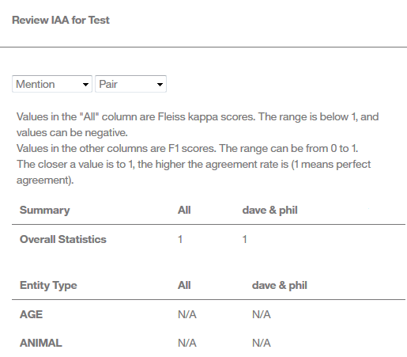

1. After you review the scores, you can decide whether you want to approve or reject document sets that are in `Submitted` status. After a document set is submitted, a check box is displayed next to its name. Take one of these actions:

    - If the scores are acceptable for a document set, select the check box and click **Approve**. Documents that do not overlap with other document sets are promoted to ground truth. Documents that do overlap must first be reviewed through adjudication so that conflicts can be resolved. For this tutorial, approve both document sets.
    - If the scores are not acceptable for a document set, select the check box and click **Reject**. The document set needs to be revisited by the human annotator to improve the annotations.

    *Figure 3. Approving document sets on the **Human Annotation** &gt; **Tasks** page*

    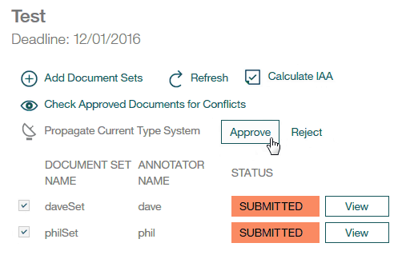

### Results

When you evaluated the inter-annotator agreement scores, you saw how different pairs of annotators annotated the same document. If the inter-annotator agreement score was acceptable, you approved the document set.

## Lesson 7: Adjudicating conflicts in annotated documents
{: #wks_tutless_ml7}

In this lesson, you will learn how to adjudicate conflicts in documents that overlap between document sets in {{site.data.keyword.watson}} {{site.data.keyword.knowledgestudioshort}}.

### About this task

When you approve a document set, only the documents that do not overlap with other document sets are promoted to ground truth. If a document is part of the overlap between multiple document sets, you must adjudicate any annotation conflicts before the document can be promoted to ground truth.

### Procedure

1. Log in to {{site.data.keyword.watson}} {{site.data.keyword.knowledgestudioshort}} as the administrator and go to the annotation task.
1. Verify that the two document sets are in an approved state.
1. Click **Check Approved Documents for Conflicts**.

    *Figure 4. Checking approved documents for conflicts on the **Human Annotation** &gt; **Tasks** page*

    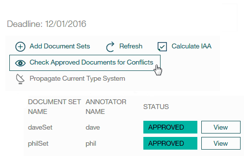

    You can see the overlapping documents that were annotated by more than one human annotator.

1. To see whether any conflicts exist in how they annotated the documents, click **Resolve Conflict**.

    *Figure 5. Resolving conflicts in documents*

    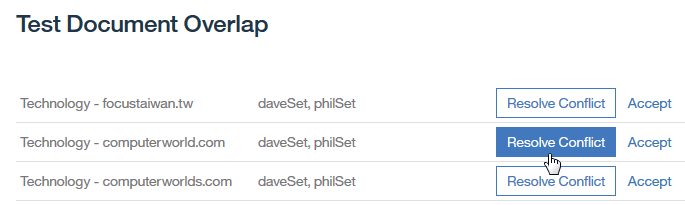

1. In adjudication mode, you can see how many annotations are in conflict and remove or replace annotations before you promote the documents to ground truth. In the tutorial documents, there are no conflicts because all of the annotations were added by the dictionary-based annotator.
1. For this tutorial, assume that you corrected all conflicts and accepted the changes. Click the **Promote to Ground Truth** icon. Repeat these steps to resolve conflicts in the second document set.

    *Figure 6. Promoting a document to ground truth in the Ground Truth Editor*

    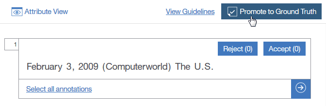

    Alternatively, you can promote a document to ground truth by clicking **Accept** on the document overlap page.

### Results

After you resolve the annotation conflicts and promote the documents to ground truth, you can use them to train the machine-learning annotator.

## Lesson 8: Creating a machine-learning annotator
{: #wks_tutless_ml8}

In this lesson, you will learn how to create a machine-learning annotator in {{site.data.keyword.watson}} {{site.data.keyword.knowledgestudioshort}}.

### About this task

When you create a machine-learning annotator, you select the document sets that you want to use to train it. You also specify the percentage of documents that are to be used as training data, test data, and blind data. Only documents that became ground truth through approval or adjudication can be used to train the machine-learning annotator.

### Procedure

1. Log in to {{site.data.keyword.watson}} {{site.data.keyword.knowledgestudioshort}} as the administrator.
1. On the Annotator Component page, click **Create Annotator**.
1. Click **Create this type of annotator** in the machine-learning annotator section.

    *Figure 7. Creating a machine-learning annotator*

    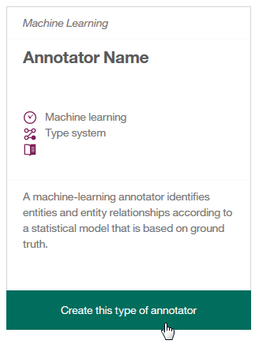

1. Select the document sets that you want to use for creating a machine-learning annotator. Click the check mark next to each document set name.
1. Use the default values for creating your testing, training, and blind data. Then, click **Train &amp; Evaluate**.

    *Figure 8. Options on the Create Annotator page*

    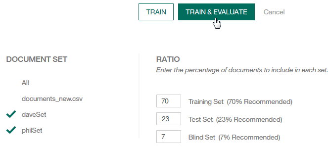

    > **Note:** Training might take more than ten minutes, or even hours, depending on the number of human annotations and the total number of words across documents.

1. After the machine-learning annotator is trained, you can export it or you can view detailed information on its performance by clicking **Details**.

    *Figure 9. A machine-learning annotator on the Annotator Component page*

    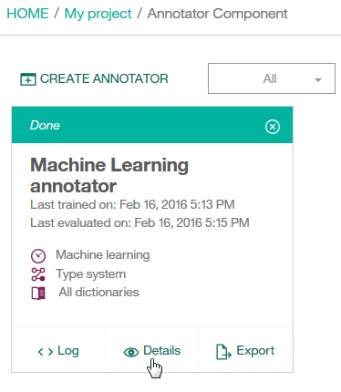

1. On the Train / Test / Blind Sets page, view the annotated documents. Click **View Ground Truth** to see the documents that human annotators worked on. Click **Decoding Results** to see the annotations that the trained machine-learning annotator created on that same set of documents.

    *Figure 10. Options on the Train / Test / Blind Sets page for a machine-learning annotator*

    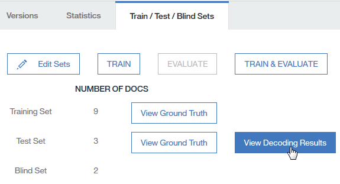

1. On the Statistics page, view details about the precision, recall, and F1 scores for the machine-learning annotator. You can view these scores for mentions, relations, and coreference chains by using the radio buttons.

    You can analyze performance by viewing a summary of statistics for entity types, relation types, and coreference chains. You can also analyze statistics that are presented in a confusion matrix. The *confusion matrix* helps you compare the annotations that were added by the machine-learning annotator to the annotations in the ground truth.

    > **Note:** In this tutorial, you annotated documents with only a single dictionary for organizations. Therefore, the scores you see are `0` or `N/A` for most entity types (except for "Organization"). The numbers are low, but that is expected, because you did not do any human annotation or correction.

    *Figure 11. Options on the Statistics page for a machine-learning annotator*

    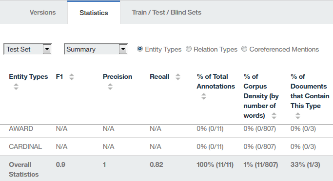

1. On the Versions page, you can take a snapshot of the annotator and the resources that were used to create it (except for dictionaries and annotation tasks). For example, you might want to take a snapshot before you change the annotator. If the statistics are poorer the next time you run it, you can promote the older version and delete the version that returned poorer results.

    *Figure 12. Options on the Versions page for a machine-learning annotator*

    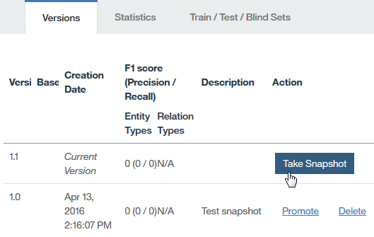

### Results

You created a machine-learning annotator, trained it and evaluated how well it performed when annotating test data and blind data. By exploring the performance metrics, you can identify ways to improve the accuracy of the machine-learning annotator.

## Tutorial summary
{: #wks_tutml_sum}

While learning about {{site.data.keyword.watson}} {{site.data.keyword.knowledgestudioshort}} , you created a machine-learning annotator.

### Lessons learned

By completing this tutorial, you learned about the following concepts:

- Document sets
- Machine-learning annotators
- Human annotation tasks
- Inter-annotator agreement and adjudication
