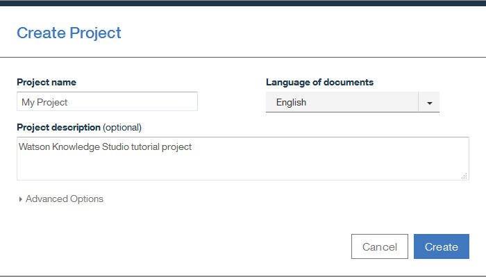
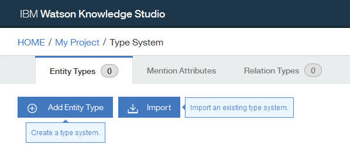
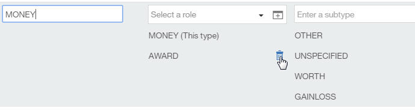
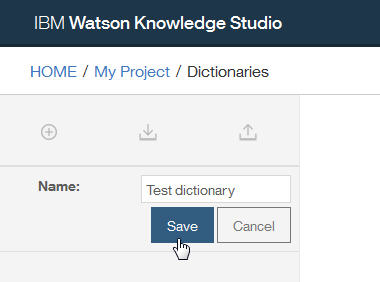
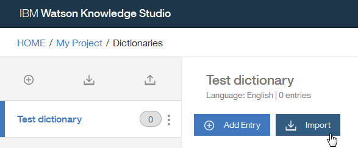
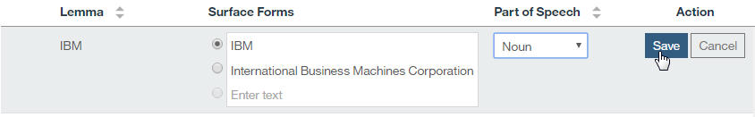

---

copyright:
  years: 2015, 2017
lastupdated: "2017-10-24"

---

{:shortdesc: .shortdesc}
{:new_window: target="_blank"}
{:tip: .tip}
{:pre: .pre}
{:codeblock: .codeblock}
{:screen: .screen}
{:javascript: .ph data-hd-programlang='javascript'}
{:java: .ph data-hd-programlang='java'}
{:python: .ph data-hd-programlang='python'}
{:swift: .ph data-hd-programlang='swift'}

This documentation is for {{site.data.keyword.knowledgestudiofull}} on {{site.data.keyword.IBM}} Marketplace. To see the documentation for the new version of {{site.data.keyword.knowledgestudioshort}} on {{site.data.keyword.cloud_notm}}, [click this link ](https://{DomainName}/docs/services/watson-knowledge-studio/tutorials-create-project.html){: new_window}.
{: tip}

# Tutorial: Creating a project
{: #wks_tutintro}

The {{site.data.keyword.knowledgestudiofull}} *Creating a project* tutorial helps you perform prerequisite tasks that must be completed before you can start any of the other tutorials.
{: shortdesc}

## Learning objectives

After you complete the lessons in this tutorial, you will know how to do the following tasks:

- Create projects
- Create type systems
- Add dictionaries

This tutorial should take approximately 15 minutes to finish. If you explore other concepts related to this tutorial, it could take longer to complete.

## Prerequisites

- Register with [myibm.ibm.com ](https://myibm.ibm.com/), and create an {{site.data.keyword.IBM_notm}} ID.
- From [{{site.data.keyword.IBM_notm}} Marketplace ](http://ibm.biz/watsonknowledge){: new_window}, sign up for a plan.
- You're using a supported browser. For information, see [Browser requirements](/docs/services/knowledge-studio/system-requirements.html).
- To complete this tutorial, you must have at least one user ID that you can use in {{site.data.keyword.watson}}&trade; {{site.data.keyword.knowledgestudioshort}}. This user ID must have the ADMIN role. If you signed up for a free plan, as the subscription owner, you have the ADMIN role. For information about user roles, see [Assembling a team](/docs/services/knowledge-studio/team.html).

## Results

After completing this tutorial, you will be ready to start creating a model.

## Lesson 1: Assigning user roles
{: #wks_tutless1}

In this lesson, you will learn about the different roles that you can assign to users in {{site.data.keyword.watson}} {{site.data.keyword.knowledgestudioshort}}.

### About this task

The creation of a machine-learning annotator requires input from subject matter experts, project managers, and users who can understand and interpret statistical models. Administrators assign roles to each user, such that they have appropriate authority for their tasks. For more information about user roles, see [Assembling a team](/docs/services/knowledge-studio/team.html).

### Procedure

1. Log in to {{site.data.keyword.watson}} {{site.data.keyword.knowledgestudioshort}} with your administrator ID.
1. Click the settings icon to open the User Account Management page. The page lists all the user IDs that are registered as {{site.data.keyword.watson}} {{site.data.keyword.knowledgestudioshort}} users. Each user ID has one of the following roles (in decreasing order of included permissions):

    - ADMIN
    - PROJECTMANAGER
    - HUMANANNOTATOR

    For more information about user roles, see [Assembling a team](/docs/services/knowledge-studio/team.html).

1. Verify that there is at least one user with the ADMIN role. A user ID with this role can create projects, and act as a project manager or human annotator.
1. If you have access to additional user IDs, verify that there are at least two users with the HUMANANNOTATOR role.

    > **Note:** A real project always requires multiple human annotators in addition to an administrator or project manager. However, for purposes of the tutorial, you can continue with a single user ID.

1. Optional: Change the role assigned to a user ID. Click the **Modify account setting** icon in the **Action** column of the table row for a user ID, and change the assigned user role.

    > **Note:** You can upgrade a user ID to a role with greater permissions, but you cannot downgrade a user with an ADMIN or PROJECTMANAGER role to the HUMANANNOTATOR role.

## Lesson 2: Creating a project
{: #wks_tutless2}

In this lesson, you will learn how to create a project within {{site.data.keyword.watson}} {{site.data.keyword.knowledgestudioshort}}.

### About this task

A project defines all of the resources that are required to create a machine-learning annotator, including training documents, the type system, dictionaries, and annotations that are added by human annotators. For more information about project creation, see [Creating a project](/docs/services/knowledge-studio/create-project.html).

### Procedure

1. As the {{site.data.keyword.watson}} {{site.data.keyword.knowledgestudioshort}} administrator, access the URL for your instance of {{site.data.keyword.watson}} {{site.data.keyword.knowledgestudioshort}}.
1. Click **Create Project**. The Create Project window opens.

    

1. Specify the details for the new project:

    - In the **Project name** field, type `My project`.
    - In the **Project description** field, type `Watson Knowledge Studio tutorial project`.
    - In the **Language of documents** field, leave **English** selected. (The sample files you will be using for this tutorial are in English.)

1. Click **Save**.

### Results

The project is created and opens automatically.

### What to do next

You can now start configuring the project resources, such as the type system.

## Lesson 3: Creating a type system
{: #wks_tutless3}

In this lesson, you will learn how to import and modify a type system within {{site.data.keyword.watson}} {{site.data.keyword.knowledgestudioshort}}. You must create or import a type system before you begin any annotation tasks.

### About this task

For more information about type systems, see [Type systems](/docs/services/knowledge-studio/typesystem.html#wks_typesystem).

### Procedure

1. Download the <a target="_blank" href="https://watson-developer-cloud.github.io/doc-tutorial-downloads/knowledge-studio/en-klue2-types.json" download>en-klue2-types.json</a> file to your computer. This file contains an example KLUE type system.
1. Within your project, click **Type System** in the banner or the navigation menu.
1. On the Type System page, click **Import**.

    

1. Select the `en-klue2-types.json` file from your computer and click **Import**. The imported type system is displayed in the table.
1. Browse the type system so you can see the data that was imported.
1. Edit an entity type:

    1. Locate the MONEY entity type.
    1. Double-click anywhere in the table row to edit the entity type.
    1. In the **Roles** column, click the  (**Delete a role**) icon next to the AWARD role.

        

    1. Click **Save**.

### What to do next

After you finish making changes to the type system, you can begin adding documents to your project.

## Lesson 4: Adding a dictionary
{: #wks_tutless4}

In this lesson, you will learn how to add a dictionary to a project in {{site.data.keyword.watson}} {{site.data.keyword.knowledgestudioshort}}. Dictionaries are used for pre-annotating text when creating a machine-learning annotator.

### About this task

For more information about dictionaries, see [Adding dictionaries to a project](/docs/services/knowledge-studio/artifacts.html#wks_projdictionaries).

### Procedure

1. Download the <a target="_blank" href="https://watson-developer-cloud.github.io/doc-tutorial-downloads/knowledge-studio/dictionary-items-organization.csv" download>`dictionary-items-organization.csv`</a> file to your computer. This file contains dictionary terms in CSV format, suitable for importing into a {{site.data.keyword.watson}} {{site.data.keyword.knowledgestudioshort}} dictionary.
1. Within your project, click **Dictionaries** in the banner or the navigation menu.
1. Click the  (**Add**) icon to add a dictionary.

    > **Note:** Do not click the  (**Import dictionary**) icon, which is used to import a dictionary that you want to use as-is. For the tutorial, you will create a new editable dictionary and then import terms into it.

1. In the **Name** field, type `Test dictionary`.
1. Click **Save** to create the (empty) dictionary.

    

    The new dictionary is created and automatically opened for editing.

1. In the dictionary pane, click **Import**.

    

1. In the Import Dictionary Entries window, select the `dictionary-items-organization.csv` file from your computer and then click **Import**. The terms in the file are imported into the dictionary.
1. Click **Add Entry** to create a new term. An editable row is added at the top of the table.
1. In the **Surface Forms** column, type `IBM` and `International Business Machines Corporation` on separate lines. (When you begin to type a new surface form, a space is added below for an additional surface form.) Leave the radio button next to `IBM` selected, indicating that this surface form is the lemma.
1. In the **Part of Speech** column, select **Noun**.
1. Click **Save**.

    

### What to do next

After you create a dictionary, you can use it to speed up human annotation tasks by pre-annotating the documents.

## Tutorial summary
{: #wks_tutsum}

While learning about {{site.data.keyword.watson}} {{site.data.keyword.knowledgestudioshort}} , you created a project and added artifacts to it.

### Lessons learned

By completing this tutorial, you learned about the following concepts:

- Projects
- Type systems
- Dictionaries
